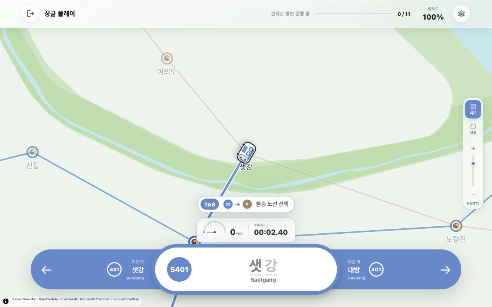
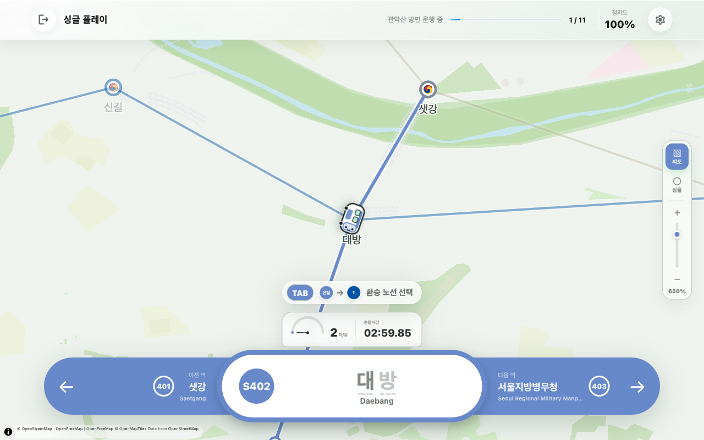

# Metro Typing

서울 지하철역 이름을 입력하며 노선을 완주하는 타이핑 게임 랜딩 사이트.  
输入首尔地铁站名、沿真实线路推进的打字游戏介绍页；页面顶部可直接游玩。

<p align="center">
  
</p>

## 站点

| 环境 | 域名                                                                                      |
| ---- | ----------------------------------------------------------------------------------------- |
| 正式 | [metrotyping.org](https://metrotyping.org)                                                |
| 测试 | [metro-typing.gengliming110.workers.dev](https://metro-typing.gengliming110.workers.dev/) |

游戏本体通过 iframe 嵌入自 [metrotyping.kr](https://metrotyping.kr/)。本仓库提供落地页、SEO 内容、多语言与部署壳。

## 截图

### 选择线路

选择地区与地铁线路（如新林线），开始一局。


### 游玩中

按站名输入推进列车，实时显示进度、准确率与打字速度。



### 运行动态

地图上的列车随正确输入前移，底部显示当前站与前后站。



## 功能概览

- **即开即玩** — 浏览器内嵌游戏，无需安装
- **真实线路** — 按首尔地铁等实际站序打字推进
- **成绩反馈** — 完赛时间、打字速度、准确率
- **多语言** — 韩语 / 英语 / 中文（Paraglide JS）
- **SEO 落地页** — 玩法介绍、FAQ、隐私政策与服务条款

## 本地开发

```bash
pnpm install
cp .env.example .env.development   # 填写 AUTH_SECRET 等
pnpm db:push
pnpm rbac:init --admin-email=admin@example.com --admin-password=your-password
pnpm dev
```

本地访问：<http://localhost:3000>

> 环境变量写在 `.env.development`（已 gitignore）。启动至少需要 `VITE_APP_URL`、`VITE_APP_NAME`、`DATABASE_PROVIDER`、`DATABASE_URL`、`AUTH_SECRET`。

## 常用命令

| 命令             | 说明                            |
| ---------------- | ------------------------------- |
| `pnpm dev`       | 开发服务器（端口 3000）         |
| `pnpm build`     | 生产构建                        |
| `pnpm cf:deploy` | 构建并部署到 Cloudflare Workers |
| `pnpm db:push`   | 同步数据库 schema（开发）       |
| `pnpm db:studio` | Drizzle Studio                  |

## 技术栈

- TanStack Start（Vite + nitro）+ React 19 + TypeScript
- Tailwind CSS 4 + shadcn/ui
- Paraglide JS（i18n）
- Drizzle ORM（SQLite / PostgreSQL / MySQL / Cloudflare D1）
- Cloudflare Workers 部署

## License

基于 ShipAny 模板构建。详见 [LICENSE](./LICENSE)。
